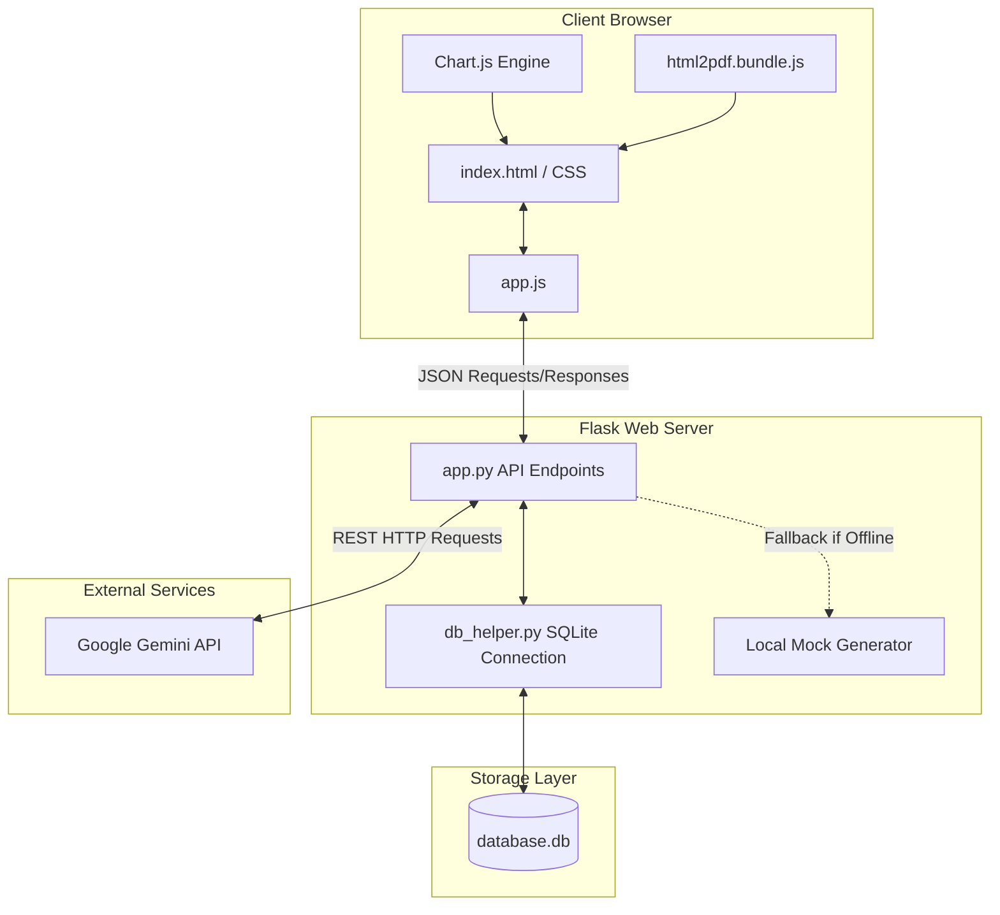

# System Architecture Diagram

This document illustrates the technical architecture and data flow of the AI Supply Chain Disruption Alert Summarizer.

---

## 1. Technical Architecture Overview
The application follows a classic client-server model with a local SQLite database for structured data storage and a REST API integration with the Google Gemini AI service.

---

## 2. Core Data Flows

### A. Alert Generation Flow
1. **User Submission**: The Admin inputs supplier credentials and raw communication in the browser, clicking "Generate AI Summary".
2. **API Dispatch**: `app.js` runs client-side verification, starts a loading spinner, and sends a `POST` request to `/api/generate`.
3. **Prompt Construction**: `app.py` receives the payload, verifies it, loads the API key, and constructs the optimized Prompt v4.
4. **AI Processing**: 
   * *Online Path*: Server sends an HTTP POST request to the Google Gemini REST endpoint. Gemini processes the text and returns a JSON string.
   * *Offline Path*: If no API key is found or connection fails, the server routes the request to the Local Mock Generator.
5. **Database Logging**: The server stores the inputs, structured AI output, response latency, and timestamp in SQLite (`generations` table).
6. **UI Rendering**: The JSON result is returned to the client and rendered in four modular glassmorphic cards.

### B. Feedback Submission Flow
1. **Star Click**: The user clicks a star rating (1-5) and enters a comment, clicking "Save".
2. **Post Call**: `app.js` sends a `POST` request to `/api/feedback`.
3. **Database Upsert**: `app.py` checks for an existing feedback entry for the generation ID. If found, it updates the record; if not, it inserts a new row in the `feedback` table.
4. **Chart Updates**: When the user navigates to "Admin Analytics", the backend aggregates these ratings, and Chart.js renders the trend charts.
